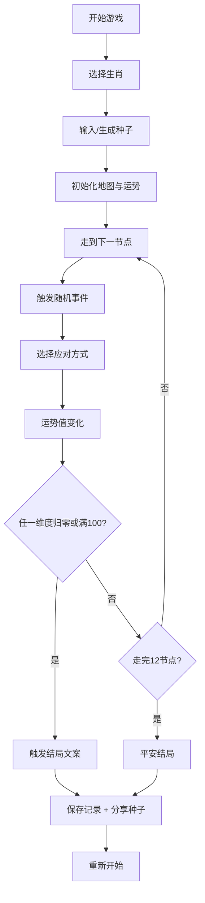

## 1. 产品概述

初一庙会抽签 Roguelike 是一款以中国传统春节庙会为背景的轻量肉鸽游戏。玩家选择生肖开局，在 12 节点的庙会地图上行走，每步遭遇随机事件，通过选择应对方式改变财、情、健、业四维运势，任一维度归零或满 100 即触发结局。

- **核心玩法**：策略选择 + 随机事件 + 运势管理
- **目标用户**：喜欢轻量休闲游戏、对中国传统文化感兴趣的玩家
- **产品价值**：快速开局、每局体验不同、可分享种子复现对局

## 2. 核心功能

### 2.1 用户角色

| 角色 | 注册方式 | 核心权限 |
|------|----------|----------|
| 玩家 | 无需注册 | 开始游戏、选择生肖、查看结局、分享种子 |

### 2.2 功能模块

1. **生肖选择页**：12 生肖选择，不同生肖有不同初始运势加成
2. **游戏主页面**：Canvas 节点地图 + 运势面板 + 事件弹窗
3. **结局展示页**：结局文案 + 本局数据 + 分享种子
4. **历史记录**：最佳结局 + 游戏统计（localStorage 存储）

### 2.3 页面详情

| 页面名称 | 模块名称 | 功能描述 |
|---------|----------|----------|
| 生肖选择页 | 生肖卡片 | 12 生肖横向排列，点击选择，显示初始运势加成 |
| 生肖选择页 | 种子输入 | 可选输入种子复现对局，或随机生成 |
| 游戏主页面 | 节点地图 | Canvas 渲染 12 节点环形地图，当前位置高亮 |
| 游戏主页面 | 运势面板 | 财/情/健/业四维运势条，实时更新 |
| 游戏主页面 | 事件弹窗 | 事件描述 + 2-3 个选择项，选择后显示运势变化 |
| 结局展示页 | 结局文案 | 根据触发结局的维度和数值展示定制文案 |
| 结局展示页 | 分享功能 | 显示本局种子，可复制分享 |
| 结局展示页 | 历史记录 | 最佳结局、对局次数、各维度结局次数统计 |

## 3. 核心流程

玩家进入游戏 → 选择生肖（可输入种子）→ 开始游戏 → 走到下一节点 → 触发随机事件 → 选择应对方式 → 运势变化 → 检查结局条件 → 继续行走 / 触发结局 → 查看结局 + 保存记录 → 重新开始

## 4. 用户界面设计

### 4.1 设计风格

- **主色调**：中国红 (#C8102E) + 金色 (#D4AF37) + 米白 (#FFF8E7)
- **辅助色**：墨绿 (#2D5A27)、藏青 (#1A237E)
- **按钮风格**：圆角矩形，红色填充金色描边，悬停有金色光晕
- **字体**：标题用书法风格字体（Ma Shan Zheng），正文用思源黑体
- **布局风格**：卡片式布局，传统纹样装饰边框
- **图标风格**：emoji 风格，生肖用 emoji 表示

### 4.2 页面设计概览

| 页面名称 | 模块名称 | UI 元素 |
|---------|----------|---------|
| 生肖选择页 | 生肖卡片 | 12 生肖 emoji、生肖名称、初始加成、选中态金色边框 |
| 生肖选择页 | 种子输入 | 输入框、随机按钮、开始按钮 |
| 游戏主页面 | 节点地图 | Canvas 环形布局、节点连线、当前位置脉冲动画 |
| 游戏主页面 | 运势面板 | 四维进度条、数值显示、不同颜色区分 |
| 游戏主页面 | 事件弹窗 | 事件标题、描述、选项按钮、运势变化预览 |
| 结局展示页 | 结局卡片 | 大标题、详细文案、运势终值、种子显示 |
| 结局展示页 | 历史记录 | 最佳结局、统计数据、再玩一次按钮 |

### 4.3 响应式

- 桌面端优先，适配移动端
- 移动端节点地图自适应缩放
- 触摸优化：按钮最小高度 44px
- 横屏/竖屏均适配

### 4.4 动效设计

- 节点选中脉冲动画
- 运势变化数字跳动动画
- 事件弹窗淡入淡出
- 结局页面粒子特效（金币/花瓣）
- 页面切换平滑过渡
