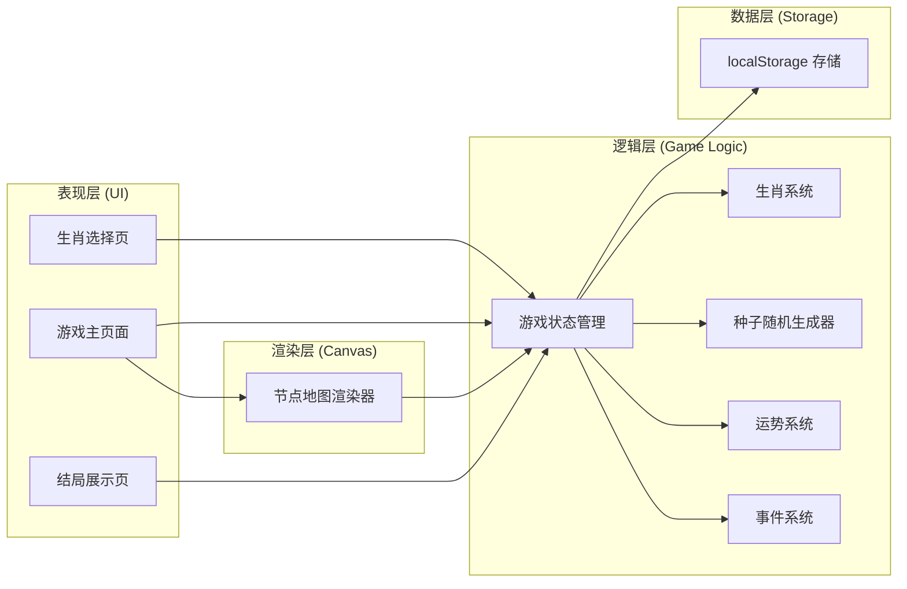

## 1. 架构设计



**架构原则**：
- 逻辑层与渲染层完全分离，逻辑层不依赖任何 UI 框架
- 纯 Canvas 渲染节点地图，不使用 Phaser（轻量需求）
- TypeScript 编写所有业务逻辑
- 状态集中管理，单向数据流

## 2. 技术描述

- **前端框架**：React@18 + TypeScript
- **构建工具**：Vite
- **样式方案**：TailwindCSS@3
- **状态管理**：Zustand
- **渲染方案**：原生 HTML5 Canvas API
- **数据存储**：localStorage
- **容器化**：Docker + nginx 静态托管
- **包管理器**：pnpm

## 3. 目录结构

```
src/
├── game/                    # 游戏逻辑层（纯 TS，无 React 依赖）
│   ├── types.ts             # 类型定义
│   ├── constants.ts         # 常量配置（生肖、事件、结局文案）
│   ├── SeededRandom.ts      # 种子随机数生成器
│   ├── Zodiac.ts            # 生肖系统
│   ├── Fortune.ts           # 运势系统
│   ├── EventSystem.ts       # 事件系统
│   ├── GameState.ts         # 游戏状态机
│   └── MapGenerator.ts      # 地图生成
├── render/                  # Canvas 渲染层
│   └── MapRenderer.ts       # 节点地图渲染器
├── store/                   # React 状态管理
│   └── useGameStore.ts      # Zustand store
├── components/              # React 组件
│   ├── ZodiacSelect.tsx     # 生肖选择
│   ├── FortunePanel.tsx     # 运势面板
│   ├── EventModal.tsx       # 事件弹窗
│   ├── GameMap.tsx          # 地图 Canvas 组件
│   ├── EndingScreen.tsx     # 结局展示
│   └── StatsPanel.tsx       # 统计面板
├── pages/                   # 页面
│   ├── HomePage.tsx         # 首页/生肖选择
│   └── GamePage.tsx         # 游戏页面
├── utils/                   # 工具函数
│   └── storage.ts           # localStorage 封装
├── App.tsx
├── main.tsx
└── index.css
```

## 4. 核心数据模型

### 4.1 运势四维

```typescript
interface Fortune {
  wealth: number;   // 财运 0-100
  love: number;     // 情运 0-100
  health: number;   // 健运 0-100
  career: number;   // 业运 0-100
}
```

### 4.2 生肖

```typescript
interface Zodiac {
  id: string;
  name: string;
  emoji: string;
  description: string;
  bonus: Partial<Fortune>;  // 初始运势加成
}
```

### 4.3 事件

```typescript
interface EventChoice {
  text: string;
  effect: Partial<Fortune>;  // 运势变化量
  resultText: string;        // 选择后的结果描述
}

interface GameEvent {
  id: string;
  type: 'redPacket' | 'quarrel' | 'noble' | 'loseMoney' | 'neutral';
  title: string;
  description: string;
  choices: EventChoice[];
}
```

### 4.4 游戏状态

```typescript
interface GameState {
  phase: 'select' | 'playing' | 'ending';
  zodiac: Zodiac | null;
  seed: string;
  currentNode: number;       // 当前节点索引 0-11
  fortune: Fortune;
  eventHistory: string[];    // 经历的事件 ID
  ending: Ending | null;
}
```

## 5. 核心算法

### 5.1 种子随机数生成器

使用 Mulberry32 算法，确保相同种子生成相同随机序列：

```typescript
class SeededRandom {
  private state: number;
  constructor(seed: string) { ... }
  next(): number { ... }       // 返回 0-1 随机数
  nextInt(min: number, max: number): number { ... }
  pick<T>(arr: T[]): T { ... }
}
```

### 5.2 事件触发逻辑

- 每个节点根据种子随机选择事件类型
- 四大事件类型：红包（增益）、口舌（减益）、贵人（特殊）、破财（财运大减）
- 每种类型有多个具体事件，随机挑选

### 5.3 结局判定

- 任一维度 = 0 → 触发该维度的"低谷结局"
- 任一维度 = 100 → 触发该维度的"巅峰结局"
- 走完 12 节点均未触发 → "平安顺遂"普通结局

## 6. 路由定义

| 路由 | 页面 | 用途 |
|------|------|------|
| / | HomePage | 生肖选择 + 种子输入 |
| /game | GamePage | 游戏主界面（地图 + 运势 + 事件） |

## 7. 存储设计

localStorage key: `temple_fair_records`

```typescript
interface GameRecords {
  totalGames: number;
  bestEnding: {
    type: string;
    fortune: Fortune;
    seed: string;
    date: string;
  } | null;
  endingCounts: Record<string, number>;
  zodiacCounts: Record<string, number>;
}
```

## 8. Docker 部署

- 使用 nginx:alpine 镜像
- 构建产物拷贝到 /usr/share/nginx/html
- docker-compose 单服务配置
- 端口映射 8080:80
